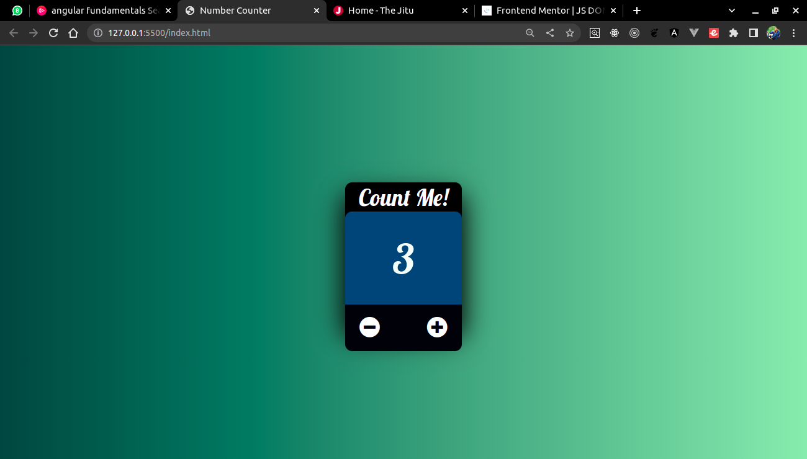

# Number-Counter

Number counter designed using JavaScript, HTML and CSS
Screenshot before the countdown

# Features
  - Increment a number
  - Decrement a number if and only if it's greater than 0
<<<<<<< HEAD
  - Use "+" and "-" buttons to increment and decrement respectively

Screenshot after the countdown

=======

Screenshot after the countdown

>>>>>>> 19a3038ab7f3b9a868a96689f30a4025cb0b1a71
